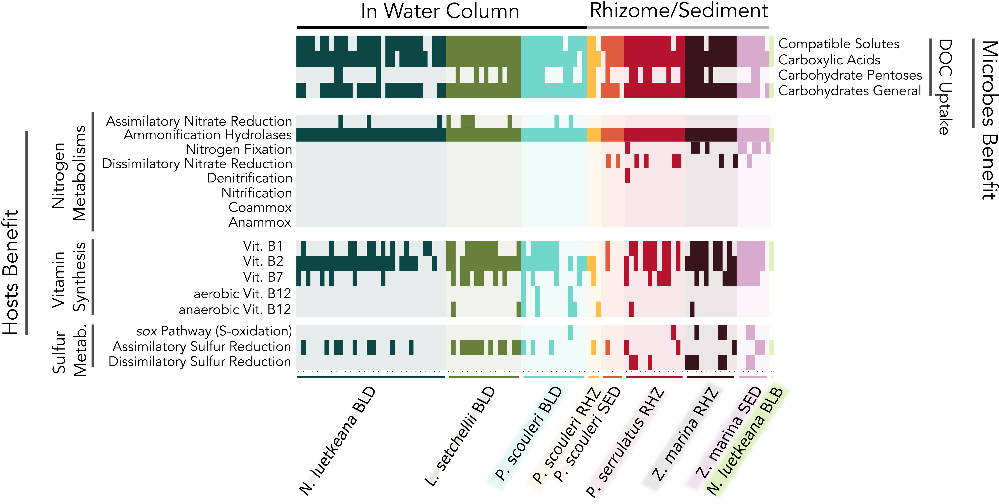

# Network Algorithm for Metabolism Detection (NAMeD)

For our study, we were interested in the metabolic capacity of microbial communities living on the surfaces of marine phototrophs. This workflow goes through how to generate Fig. 3 (below)



## Generating a masterdata file

<i>You can either follow the section below or if you want to just go straight to working with the algorithm, download </i>`tatoosh_masterdata.txt`<i> and </i>`tatoosh_MAG_names.txt`<i> from our figShare repo: 10.6084/m9.figshare.20152949. Save this in this folder and go on to the next section.</i>

From the <a href='../01_Raw_Sequences_to_MAGs.md'> Raw Sequences to MAGs Workflow</a>, we are left with `CONTIGS.db` and `PROFILE.db` files for <b>8 metagenomes</b> that have been clustered and cleaned into MAGs with high completion and low redundancy. 

The genes in each metagenome have also been identified by Prodigal (Hyatt et al. 2010) and annotated by three databases: KEGG (Kanehisa 2000), COG (Galperin et al. 2015) and Pfam (Mistry et al. 2021) using `anvi-run-kegg-kofams`, `anvi-run-ncbi-cogs`, and `anvi-run-pfams`. 

We start with these files to compile a single masterdata tab-delimited file that we can query for any metabolism. From these, I extract specific data:
- Gene-Split data (maps each gene to a split) using
    ```
    anvi-export-table CONTIGS.db --table genes_in_splits
    ```
- Split-Bin data (maps each split to a bin) (COLLECTION_NAME is FINAL_MG4 for Laminaria setchellii data)
    ```
    anvi-export-collection -p PROFILE.db -C COLLECTION_NAME
    ```
- Gene Function data (metabolic function of each gene)
    ```
    anvi-export-functions -c CONTIGS.db
    ```
- TaxID of each bin (taxonomy corresponding to each Bin)
    ```
    anvi-estimate-scg-taxonomy -p PROFILE.db -c CONTIGS.db -C COLLECTION_NAME
    ```

The files will all emerge with generic names so take the time to rename them between each metagenome processed. 

Once you have all of these files, remove the headers and concatenate all similar files into one file (eg. `MG1_genes_in_splits.txt` and `MG2_genes_in_splits.txt`...`MG8_genes_in_splits.txt` into one `genes_in_splits.txt`). Put this file into `assets/`

Then, once updating the basepaths in `gen_masterdata.py`, run 
```
python gen_masterdata.py
```

## Pathway Algorithm to identify Vitamin metabolisms
The pathway algorithm was developed for the case of detecting entire metabolic pathways. It's useful when dealing with metabolic pathways that are long (>10 steps) with alternative pathways available that may repeat gene usage. Particularly useful with pathways like the Vitamin B12 pathway that has both aerobic and anaerobic pathways present. 

### The Approach
This approach treats all genes in a KEGG definition like a nodes in a graph. 

The genes at the start of the pathway are treated as the source nodes and those at the end are the target nodes. 

I then use `get_all_simple_paths` from the `iGraph` package to find each possible path from <i>each</i> source node to <i>each</i> target node. This generates a large list of possible paths between source and target nodes.

Then I query the `masterdata file` generated above for all possible genes in each possible pathway. 

The nitty-gritties of the pathway can be found <a href='./pathwayAlgorithm/'></a>. Ideally, I'd have a parser that takes in a KEGG definition and then spits out a graph. But maybe I'll do that later. The function remains the same.

Any of the pathway files can be run using (provided the dependencies are installed):
```
python pathwayBiotin.py
```

## Carbon Metabolisms

Using the gene set developed by Poretsky et al. (2010) that identifies transporter genes related to dissolved organic carbon metabolisms, this chunk of code counts the number of such genes are present in the broad categories: Compatible Solutes, Carboxylic Acids, Carbohydrates Pentoses, Carbohydrates General. 

After updating corresponding filenames, run:
```
python finalCarbon.py
```

## Ammonification Hydrolases

Ammonification hydrolases are a way that microbial communities may gain access to ammonia by breaking up more complex proteins into amino acids, releasing ammonia in the process. We compiled a list of enzymes that do exactly this in `assets/ammonificationHydrolases.txt`. These enzymes are all those from the classes:
- EC:1.4 - Acting on the CH-NH2 group of donors
- EC:3.5 - Acting on carbon-nitrogen bonds, other than peptide bonds
- EC:4.3.1 - Ammonia-lyases

I inputed these search terms into the Orthology Database in genome.jp, took all the KEGG calls from the results and put them into the file above. The enzymes that do this are highly varied and can also be viewed in Supplementary Table `Table S4`.

I then just run this through the command line interface.
```
python cnBonds_misc_data.py
```

## Visualizing

The final graph was made in R. Details can be found in `heatmapGen.R`. The output needs a lot of refining to look submission quality which I ended up doing in <a href="https://inkscape.org/">Inkscape</a> - an open source Photoshop. Check it out!

The main manuscript has the figure without the MAG names along the x-axis. However, the Fig S2 <i>does</i> have the MAG names. Both `.png` files are in this folder.

## <i>References</i>
- Hyatt D, Chen G-L, LoCascio PF, Land ML, Larimer FW, Hauser LJ. 2010. Prodigal: prokaryotic gene recognition and translation initiation site identification. BMC Bioinformatics 11:119.
- Kanehisa M. 2000. KEGG: Kyoto Encyclopedia of Genes and Genomes. Nucleic Acids Research 28:27–30.
- Galperin MY, Makarova KS, Wolf YI, Koonin EV. 2015. Expanded microbial genome coverage and improved protein family annotation in the COG database. Nucleic Acids Research 43:D261–D269.
- Mistry J, Chuguransky S, Williams L, Qureshi M, Salazar GA, Sonnhammer ELL, Tosatto SCE, Paladin L, Raj S, Richardson LJ, Finn RD, Bateman A. 2021. Pfam: The protein families database in 2021. Nucleic Acids Research 49:D412–D419.
- Poretsky RS, Sun S, Mou X, Moran MA. 2010. Transporter genes expressed by coastal bacterioplankton in response to dissolved organic carbon. Environmental Microbiology 12:616–627.
