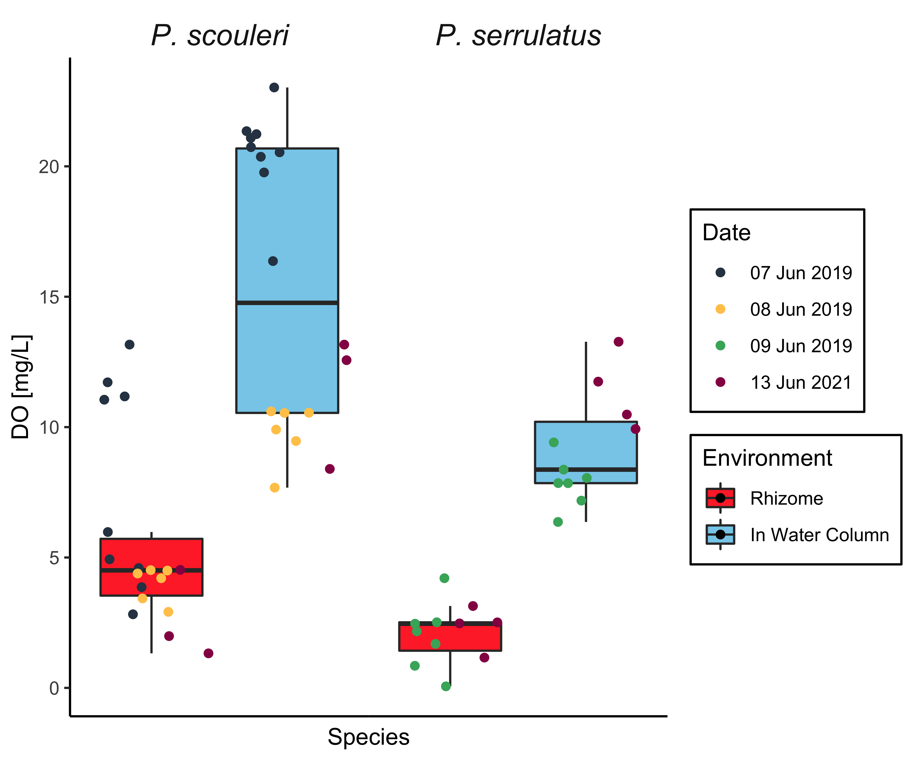

# Fig 1: Generate our boxplot comparison of dissolved oxygen within the water column and within the rhizosphere

This is a pretty straightforward task to generate fig1 - one of the really exciting findings of our project. A low oxygen environment in the intense surge and dynamically oxygenated Northeast Pacific!

The R code is pretty straightforward.