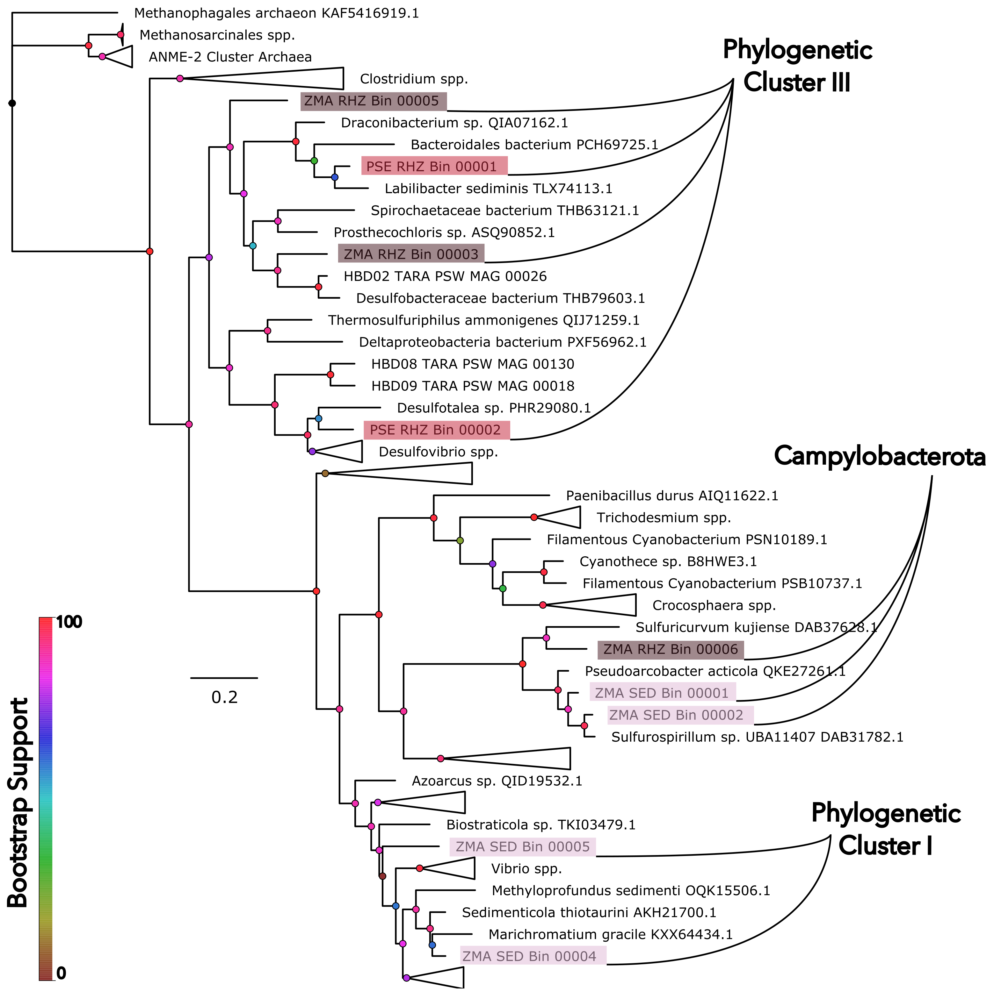

# Generating a nifH phylogenetic figure
<p text-align='center'>

</p>
This workflow goes through the steps taken to generate Fig. 2 that places the nifH genes found within the broader phylogenetic context of the nifH gene. The files used are in this folder. 

Quick learnings:
- We originally attempted to `Protein-BLAST` all our fasta files against three well known databases (Farnelid, FunGene and Zehr). However, all three databases appeared to have been contaminated by genes associated with the nifH family.

## Gene Annotation and Identification
- `Prodigal` was used to identify Open Reading Frames (ORFs) (Hyatt et al. 2011). 
- These ORFs were annotated using `anvi-run-kegg-kofams`, `anvi-run-ncbi-cogs`, and `anvi-run-pfams` which uses the Kyoto Encyclopedia of Genes and Genomes (KEGG) (Kanehisa 2000), NCBI’s Clusters of Orthologous Genes (COGs) (Galperin et al. 2015) and PFam (Mistry et al. 2021). 
- We selected genes annotated with the KEGG identifier `K02588`, which corresponds to the nifH gene, with e-value < 1e-100. We checked the COG annotation on the same genes. All genes were annotated with the COG identifier for nifH, `COG1348` with e-values <1e-100. This was reliable inference that the genes were indeed nifH. 
- We additionally also verified neighbouring genes on the same contig for other <i>nif</i> related genes. The results are displayed in `Table S5` in the Supplementary Tables.
- This yielded <b>9 nifH amino-acid sequences</b>.

## Reference nifH genes
In `reference.fa`, we curated a set of 85 reference nifH amino acid sequences that spanned the spectrum of the nifH family. To this we added the 9 amino acid sequences identified above as nifH genes.

We then aligned all sequences using Muscle ()
```
muscle -in reference.fa -out align.fa
```

We then used `trimAl` (Capella-Gutierrez et al. 2009) on the alignment with a gap-threshold of 50%. This goes through each character in the alignment and removes any character where a gap appears in 50% of the sequences.
```
trimal -in align.fa -out trim.fa -gt 0.5 -keepheader
```

This was then fed into anvi-script-reformat-fasta which removes any sequence where more than 50% of the sequence are gap characters
```
anvi-script-reformat-fasta trim.fa --max-percentage-gaps 50 -o g50.fa
```

Finally, we placed the sequences into `IQTree` (Nguyen et al. 2015) that first uses ModelFinder (Kalyaanamoorthy et al. 2017) on a subset of LG models and then infers a maximum-likelihood phylogeny based on 1000 bootstrap replicates.
```
iqtree -s g50.fa -nt AUTO -bb 1000 -alrt 1000 -mset LG
```

Finally, we loaded the output `g50.fa.treefile` into FigTree and visual aesthetics were spruced up using InkScape

## Quickshot
If you want to go through all of these steps in the snap of the number of threads your computer runs on, just run:
```
bash tree_builder.sh
```

## References
- Hyatt D, Chen G-L, LoCascio PF, Land ML, Larimer FW, Hauser LJ. 2010. Prodigal: prokaryotic gene recognition and translation initiation site identification. BMC Bioinformatics 11:119.
- Kanehisa M. 2000. KEGG: Kyoto Encyclopedia of Genes and Genomes. Nucleic Acids Research 28:27–30.
- Galperin MY, Makarova KS, Wolf YI, Koonin EV. 2015. Expanded microbial genome coverage and improved protein family annotation in the COG database. Nucleic Acids Research 43:D261–D269.
- Mistry J, Chuguransky S, Williams L, Qureshi M, Salazar GA, Sonnhammer ELL, Tosatto SCE, Paladin L, Raj S, Richardson LJ, Finn RD, Bateman A. 2021. Pfam: The protein families database in 2021. Nucleic Acids Research 49:D412–D419.
- Edgar RC. 2004. MUSCLE: multiple sequence alignment with high accuracy and high throughput. Nucleic Acids Research 32:1792–1797.
- Capella-Gutierrez S, Silla-Martinez JM, Gabaldon T. 2009. trimAl: a tool for automated alignment trimming in large-scale phylogenetic analyses. Bioinformatics 25:1972–1973.
- Nguyen L-T, Schmidt HA, von Haeseler A, Minh BQ. 2015. IQ-TREE: A Fast and Effective Stochastic Algorithm for Estimating Maximum-Likelihood Phylogenies. Molecular Biology and Evolution 32:268–274.
- Kalyaanamoorthy S, Minh BQ, Wong TKF, von Haeseler A, Jermiin LS. 2017. ModelFinder: fast model selection for accurate phylogenetic estimates. Nat Methods 14:587–589.

